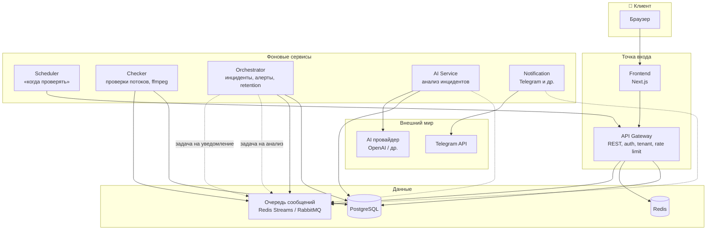

# Целевая архитектура: как должно выглядеть (2026)

Документ описывает, **как должна быть устроена** платформа HLS Monitoring по лучшим практикам 2026 года. Написан так, чтобы было понятно новичку: сначала картинка «кто с кем разговаривает», потом правила и термины.

---

## 1. Главная идея одной картинкой

**Пользователь** заходит в браузер → видит **Frontend** (сайт). Frontend общается **только с одним входом** — **API (Gateway)**. API решает: проверить права, отдать данные из БД или отправить задачу «в фоновую работу». Тяжёлая работа (проверки потоков, анализ AI, рассылка уведомлений) делается **отдельными сервисами**, которые не тормозят ответ пользователю. Сервисы общаются по **очередям сообщений** и по **HTTP** только там, где нужен немедленный ответ.

```
┌─────────────┐     HTTPS      ┌──────────────────────────────────────────────────────────┐
│   Браузер   │ ──────────────►│  Frontend (Next.js)                                        │
│  (пользователь)              │  Показывает UI, дергает только API                         │
└─────────────┘                └───────────────────────────┬───────────────────────────────┘
                                                             │
                                                             │ HTTP (REST)
                                                             ▼
┌─────────────────────────────────────────────────────────────────────────────────────────┐
│  API (Gateway) — единая точка входа                                                        │
│  • Авторизация, RBAC, tenant (company_id)                                                 │
│  • Rate limit, CORS, метрики                                                             │
│  • CRUD: компании, проекты, потоки, проверки (постановка в очередь), результаты, инциденты │
│  • Не делает: ffmpeg, вызов AI, отправку в Telegram                                       │
└───┬─────────────────┬─────────────────┬─────────────────────────────────────────────────┘
    │                 │                 │
    │ Postgres        │ Redis           │ Очередь (Redis Streams / RabbitMQ)
    │ (основные       │ (rate limit,    │ «задачи на проверку», «задачи на уведомление»,
    │  данные)        │  кэш при        │ «задачи на AI-анализ»
    │                 │  желании)       │
    ▼                 ▼                 ▼
┌──────────┐   ┌──────────┐   ┌─────────────────────────────────────────────────────────────┐
│ Postgres │   │  Redis   │   │  Фоновые сервисы (воркеры)                                    │
│          │   │          │   │  • Scheduler: по расписанию создаёт «проверить поток»        │
│ Единый   │   │          │   │  • Checker: забирает задачу → ffmpeg/плейлисты → пишет результат │
│ источник │   │          │   │  • Orchestrator: инциденты, алерты, ставит задачи в AI и      │
│ истины   │   │          │   │    уведомления, retention                                     │
│          │   │          │   │  • AI Service: забирает «проанализировать инцидент» → модель → │
│          │   │          │   │    cause/summary в БД                                         │
│          │   │          │   │  • Notification: забирает «отправить в Telegram» → отправка │
└──────────┘   └──────────┘   └─────────────────────────────────────────────────────────────┘
```

Итог: **один вход для клиента (API)**, **разделение по ответственности** (каждый сервис — одна зона), **асинхронность через очереди**, **без секретов в коде и логах**.

---

## 2. Диаграмма целевой архитектуры (Mermaid)

Ниже — как система должна выглядеть после выделения микросервисов. Прямые стрелки — вызовы по HTTP, пунктир — сообщения в очередь.



**Как читать:** всё, что пользователь делает в интерфейсе, идёт через Frontend → API. Тяжёлая и долгая работа выполняется воркерами; они получают задачи из очереди или из БД и не блокируют ответ пользователю.

---

## 3. Лучшие практики 2026 (как мы им следуем)

Краткий список принципов и как они отражены в целевой архитектуре.

| Практика | Что это значит простыми словами | Как у нас |
|----------|----------------------------------|-----------|
| **Единая точка входа (API Gateway)** | Весь внешний трафик идёт через один слой: авторизация, маршрутизация, лимиты в одном месте. | Один API: auth, RBAC, tenant, rate limit, все REST-эндпоинты. Frontend и Scheduler ходят только в API (или в очередь по контракту). |
| **Разделение по зонам ответственности** | Каждый сервис отвечает за одну область: «только проверки», «только уведомления», «только AI». | Checker — только проверки; Notification — только доставка; AI Service — только анализ; Orchestrator — оркестрация инцидентов и алертов. |
| **Асинхронность через очереди** | Долгие задачи не делаются «в ответ на запрос», а ставятся в очередь; воркер забирает и обрабатывает. | Задачи на проверку, на AI, на уведомление попадают в очередь; API и фронт не ждут их завершения. |
| **Один источник истины по данным** | Состояние хранится в одном месте (БД), а не дублируется по сервисам. | PostgreSQL — основной источник истины; очереди только переносят «команды», не заменяют БД. |
| **Изоляция тенантов (multi-tenant)** | Данные разных компаний не смешиваются; везде явный company_id. | Все маршруты и запросы в БД с company_id; в сообщениях очереди тоже tenant (company_id). |
| **Секреты только в окружении** | Пароли, токены, API-ключи — только в ENV/секретах, не в коде и не в логах. | Каждый сервис получает свои секреты через ENV; в логах и ответах секреты не выводятся. |
| **Наблюдаемость (observability)** | Можно понять, что делал запрос и почему упал: логи, метрики, трассировка. | Health/ready, метрики (API, Worker), при необходимости — OpenTelemetry; структурированные логи без секретов. |
| **Устойчивость к сбоям** | Падение одного сервиса не роняет всё; повторные попытки и таймауты. | Воркеры забирают задачи идемпотентно; таймауты на вызовы AI/Telegram; при падении воркера задачи остаются в очереди/БД. |
| **Контракты между сервисами** | Формат запросов/ответов и сообщений зафиксирован и версионируется. | REST API по docs/api_contract.md; контракт AI — docs/ai_incident_contract.md; форматы сообщений в очереди описываются в ADR. |

---

## 4. Слои и кто с кем разговаривает

Упрощённо — три слоя.

- **Слой доступа:** пользователь видит только Frontend; Frontend говорит только с API. Сторонние системы (например, будущие интеграции) тоже идут через API или через отдельный контур (очередь) по контракту.
- **Слой приложения:** API (синхронные запросы) и воркеры (асинхронные задачи). API пишет/читает БД и ставит задачи в очередь; воркеры забирают задачи, обращаются к БД и к внешним API (AI, Telegram).
- **Слой данных:** PostgreSQL (основные данные), Redis (rate limit, при необходимости кэш), очередь сообщений (задачи для воркеров), файловое хранилище или S3 (скриншоты).

Правило для новичка: **ни один сервис не обращается «напрямую» к БД другого домена** в обход контракта. Либо через API, либо через общую БД и общие таблицы с явным tenant (company_id).

---

## 5. Потоки данных (примеры)

**Пример 1: пользователь нажал «Запустить проверку»**

1. Frontend → API: `POST /api/v1/companies/1/streams/2/check-jobs`.
2. API проверяет права и tenant, создаёт запись в БД (check_jobs, status=queued) и при необходимости публикует сообщение в очередь.
3. API возвращает 202 Accepted и id задачи.
4. Checker (или текущий Worker) забирает задачу из очереди/БД, выполняет проверки, пишет результат в БД.
5. Пользователь обновляет страницу или получает результат через API: `GET .../check-jobs/{id}/result`.

**Пример 2: инцидент WARN/FAIL — нужен AI-анализ**

1. Orchestrator (или текущий Worker) после сохранения результата проверки решает: нужен анализ.
2. Кладёт в очередь сообщение: «проанализировать инцидент: job_id, company_id, stream_id, путь к скриншоту, метрики».
3. AI Service забирает сообщение, вызывает модель (внешний API), получает cause/summary, пишет в БД (ai_incident_results).
4. Пользователь видит вывод AI в UI через API: `GET .../check-jobs/{id}/result` (в ответ входит блок AI).

**Пример 3: отправить алерт в Telegram**

1. Orchestrator решает: алерт нужно отправить (streak/cooldown).
2. Публикует в очередь: «отправить alert: company_id, stream_id, текст, chat_id».
3. Notification забирает сообщение, вызывает Telegram API, при ошибке — retry по своей политике.

---

## 6. Словарик для новичка

| Термин | По-простому |
|--------|--------------|
| **API Gateway** | Единственный «вход» для клиентов: проверяет кто зашёл, куда пускать, ограничивает частоту запросов. |
| **Микросервис** | Отдельная программа (процесс/контейнер), которая решает одну задачу: например «только проверки» или «только уведомления». |
| **Очередь сообщений** | «Почтовый ящик»: один сервис кладёт задачу, другой забирает и выполняет. Не нужно ждать сразу — работа идёт в фоне. |
| **Tenant (тенант)** | Организация/компания. У нас все данные привязаны к company_id — чтобы одна компания не видела данные другой. |
| **RBAC** | Роли (super_admin, company_admin, viewer): кто что может делать в системе. |
| **Source of truth** | Место, где «правда» хранится один раз (у нас — PostgreSQL для бизнес-данных). |
| **Observability** | Умение понять, что происходит в системе: логи, метрики, трассировка запросов. |
| **Idempotency** | Повтор одного и того же действия даёт тот же результат и не ломает данные (например, повторная обработка задачи из очереди). |

---

## 7. Связь с другими документами

- **Текущее состояние кода и план выделения сервисов:** `_archive/docs/microservices_audit.md`.
- **Текущие слои и пакеты в коде:** `docs/arch_overview.md`.
- **Решения (ADR):** `docs/decisions.md`.
- **Контракт REST API:** `docs/api_contract.md`.
- **Контракт AI:** `docs/ai_incident_contract.md`.

Целевая архитектура в этом документе — это «как должно быть»; реализация идёт поэтапно по плану из `_archive/docs/microservices_audit.md`.
